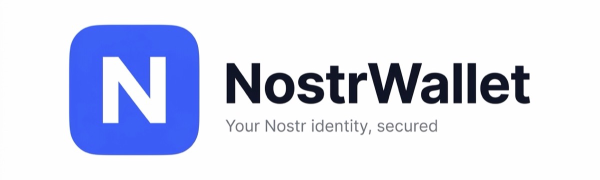
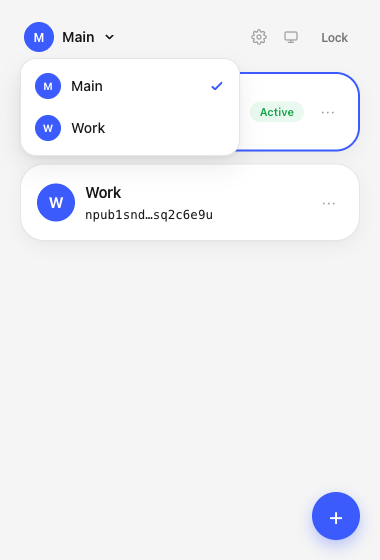
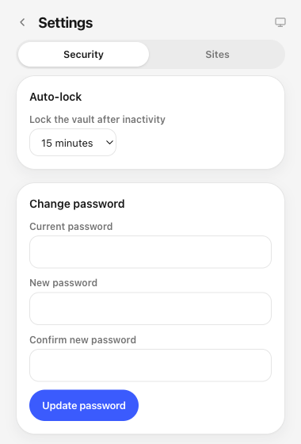
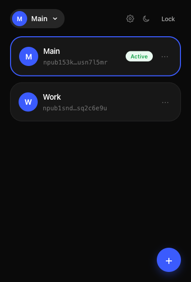

<p align="center">
  <picture>
    <source media="(prefers-color-scheme: dark)" srcset="assets/banner-dark.png">
    <source media="(prefers-color-scheme: light)" srcset="assets/banner-light.png">
    
  </picture>
</p>

<p align="center">
  <a href="https://github.com/slashbinslashnoname/nostrwallet/releases/latest"></a>
  <a href="LICENSE"></a>
  
  
</p>

<p align="center">
  An all-in-one <a href="https://nostr.com">Nostr</a> identity signer for your browser.<br>
  Your keys stay encrypted, on your device, always.
</p>

---

## What it does

NostrWallet injects the standard `window.nostr` (NIP-07) API into every page, so any Nostr
website or web client can ask for your public key, request an event signature, or use
NIP-04/NIP-44 encryption — always with your explicit approval.

- 🔐 **Locally encrypted vault** — private keys are encrypted with AES-256-GCM under a
  password-derived key (PBKDF2, 600,000 iterations). Nothing ever leaves your device.
- 🪪 **Multiple identities** — generate or import (`nsec`/hex) as many identities as you
  want, switch between them from a quick-picker, give each a color.
- ✅ **Per-site permissions** — allow once, for a week, or always, per method and per
  event kind. Revoke anything at any time from Settings.
- 🌓 **Light / dark theme** — follows your system or set manually.
- 🔒 **Auto-lock** — the vault locks itself after a configurable period of inactivity.
- 🧭 **Settings, in the extension** — no separate options tab to hunt for; everything is
  reachable from the popup.

No telemetry, no analytics, no accounts, no servers.

## Screenshots

<p align="center">
  
  
  
</p>

## Install

**From source:**

```bash
git clone git@github.com:slashbinslashnoname/nostrwallet.git
cd nostrwallet
npm install
npm run build
```

Then in Chrome: `chrome://extensions` → enable **Developer mode** → **Load unpacked** →
select the `dist/` folder.

**From a release:** download `dist.zip` from the
[latest release](https://github.com/slashbinslashnoname/nostrwallet/releases/latest),
unzip it, and load the folder the same way.

## How signing requests work

1. A website calls `window.nostr.getPublicKey()`, `.signEvent(event)`, or a NIP-04/NIP-44
   encrypt/decrypt method.
2. The request goes through a permission check for that origin + method (+ event kind, for
   signing). If there's no standing decision, a popup asks you to **Allow** or **Deny**,
   with an option to remember the choice once, for a week, or forever.
3. Only on an explicit or remembered **Allow** does the background service worker decrypt
   your key and produce a result — the page never sees your private key, ever.

## Security model

- Private keys are decrypted only in memory, inside the background service worker; content
  scripts and web pages never have access to them.
- The encrypted vault lives in `chrome.storage.local`; the derived unlock key lives in
  `chrome.storage.session` (memory-only, cleared on browser restart, marked
  `TRUSTED_CONTEXTS` so pages can never read it).
- Message passing between the injected page API and the background is origin-checked at
  every hop — the page can never spoof which site is making a request.

## Tech stack

Vite + [`@crxjs/vite-plugin`](https://crxjs.dev/vite-plugin) · React · Tailwind CSS v4 ·
[`nostr-tools`](https://github.com/nbd-wtf/nostr-tools)

## License

[MIT](LICENSE)
